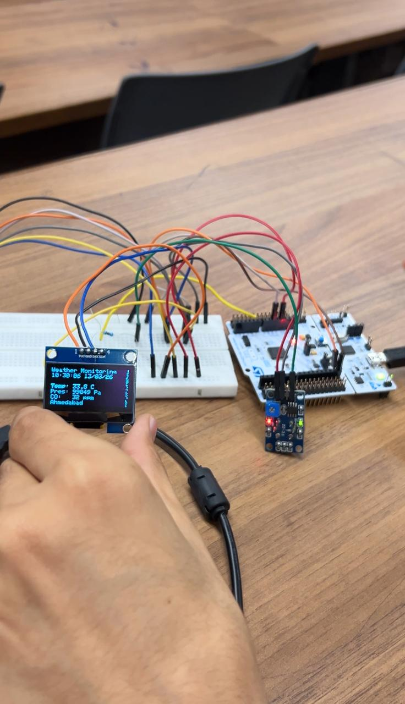
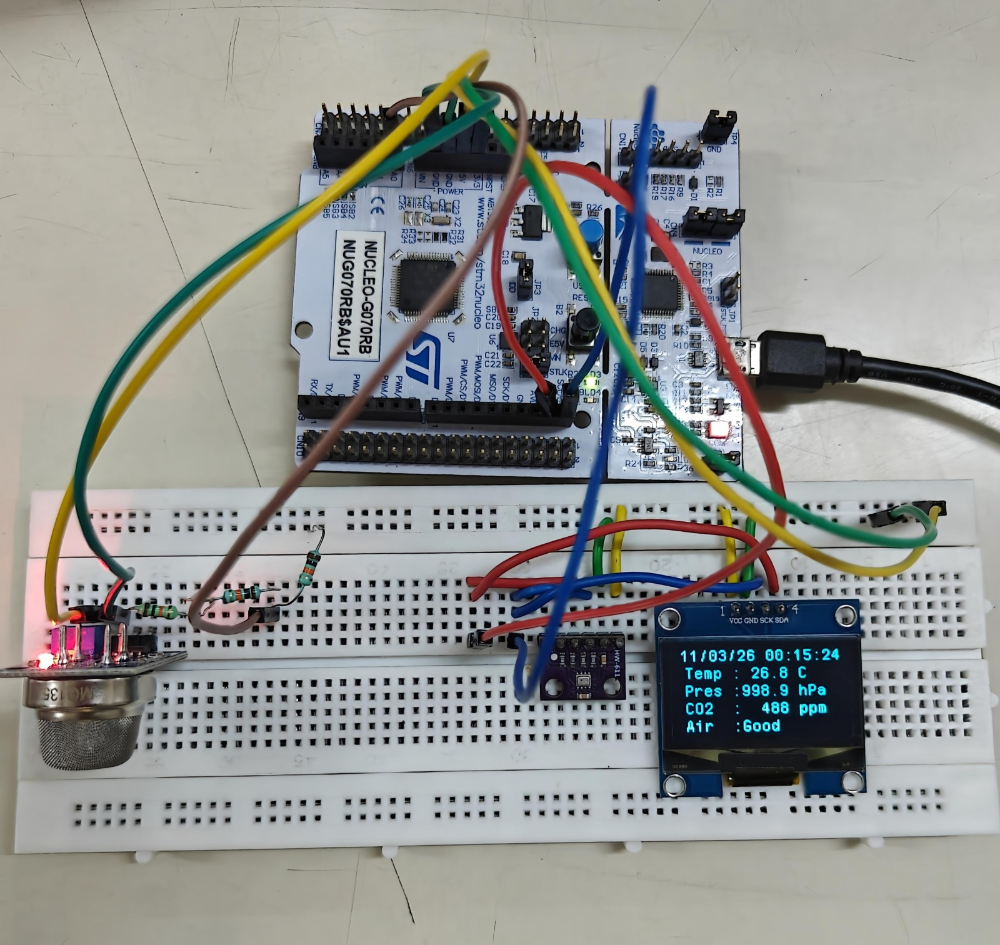
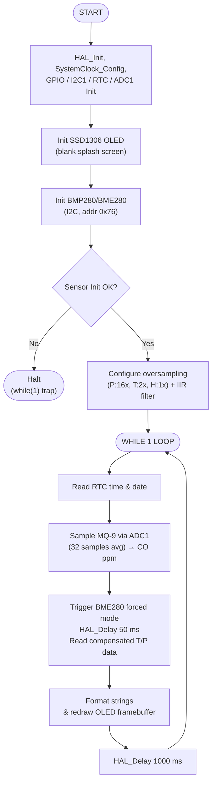

# Environmental Monitoring System — STM32 Nucleo-F446RE

A standalone embedded air-quality monitor built on the **STM32 Nucleo-F446RE** (ARM Cortex-M4). It reads temperature, pressure, and carbon monoxide (CO) concentration and displays them in real time on a 128×64 SSD1306 OLED, timestamped by the on-chip RTC — with no external MCU board support package or cloud dependency.

Built using **STM32 HAL** (STM32CubeIDE / STM32CubeMX), not bare-metal register programming.



---

## Features

- Real-time temperature and pressure readout from a BMP280-compatible sensor over I2C
- Carbon monoxide (CO) concentration estimation from an MQ-9 gas sensor using a power-law curve fit derived from the Hanwei MQ-9 datasheet
- Live OLED display (SSD1306, 128×64, I2C) refreshed every 1 second
- On-chip RTC for date/time stamping (LSI-clocked, no external crystal required)
- 12-bit ADC sampling (32-sample averaging) for stable gas-sensor readings
- Fully HAL-based, modular firmware generated and configured via STM32CubeMX

## Hardware List

| Component | Interface | Notes |
|---|---|---|
| STM32 Nucleo-F446RE | — | ARM Cortex-M4 @ 84 MHz |
| BMP280-compatible module (sold as BME280) | I2C (0x76) | See [Known Hardware Issue](#known-hardware-issue) |
| MQ-9 Gas Sensor | Analog → ADC1/PA0 | CO detection, 5 V heater |
| SSD1306 OLED, 1.3", 128×64 | I2C (0x3C) | Shared I2C1 bus |
| 2 × 10 kΩ Resistors | — | Voltage divider for MQ-9 AOUT (5 V → 2.5 V) |
| Breadboard + jumper wires | — | — |

## Peripherals Used

This project uses the following STM32 peripherals, configured through STM32CubeMX and driven with the **HAL (Hardware Abstraction Layer)**:

- **GPIO** — LED, user button, bus lines
- **I2C1** (400 kHz Fast Mode) — shared bus for the BMP280 sensor and the SSD1306 OLED
- **ADC1** (12-bit, channel 0 / PA0) — MQ-9 analog readout
- **RTC** (LSI-clocked, 1 Hz tick) — date/time stamping

> **Note:** USART2 TX/RX pins are reserved by the Nucleo board's default pinout (routed to the ST-Link Virtual COM Port) but the USART peripheral is **not initialized or used** by this firmware — there is no serial logging in the current version. SPI is not used in this design; the OLED and sensor both communicate over I2C.

## Hardware Connections

| Device | Pin | Nucleo Pin | Notes |
|---|---|---|---|
| BMP280 module | VCC | CN6-4 (+3V3) | 3.3 V only |
| | GND | CN6-6 (GND) | — |
| | SCL | CN10-3 (PB8) | I2C1_SCL |
| | SDA | CN10-5 (PB9) | I2C1_SDA |
| SSD1306 OLED | VCC | CN6-4 (+3V3) | 3.3 V |
| | GND | CN6-6 (GND) | — |
| | SCK | CN10-3 (PB8) | Shared I2C bus |
| | SDA | CN10-5 (PB9) | Shared I2C bus |
| MQ-9 | VCC | CN7-16 (5V) | Heater, 5 V |
| | GND | CN6-6 (GND) | — |
| | AOUT | Divider tap → PA0 | 2×10 kΩ divider (5 V → 2.5 V) |



## Known Hardware Issue — Humidity Unavailable

The environmental sensor module used in this build was purchased and sold as a **BME280**, but testing after assembly showed it is actually a **BMP280-compatible module** — it does not contain the humidity-sensing die that a genuine BME280 has. This was discovered only once the sensor was already integrated and tested, which is why the humidity line was disabled after the fact rather than during initial development.

Because the die simply isn't there, the BME280 driver returns a humidity value of **0%**, which is what an earlier OLED capture shows. Once this was identified, the humidity print line was deliberately commented out in `main.c` (see below) so the display no longer shows a meaningless 0% reading:

```c
SSD1306_GotoXY(2, 18);
// SSD1306_Puts(hum_string, &Font_6x8, 1);
```

As a result:

| Measurement | Status |
|---|---|
| Temperature | ✅ Working |
| Pressure | ✅ Working |
| Humidity | ❌ Not available on this hardware |

This is **not a firmware bug**. The Bosch BME280 driver is used as-is (it is source-compatible with BMP280 registers for temperature and pressure), and the humidity read/print line is intentionally commented out in `main.c` since the sensor cannot supply a valid value. No humidity data is faked or hardcoded.

**Fix:** Swapping in a genuine BME280 module (same I2C address, same footprint) will restore humidity readings with no firmware redesign — only re-enabling the existing `hum_string` display line and using the humidity oversampling setting that is already configured in the driver.

## Software Architecture

```
Core/
├── Inc/
│   ├── main.h
│   ├── ssd1306.h, fonts.h
│   └── BME280/bme280.h, bme280_defs.h
└── Src/
    ├── main.c              # Application logic, peripheral init, sensor loop
    ├── ssd1306.c            # SSD1306 OLED driver (I2C)
    ├── fonts.c              # Font_6x8 bitmap font
    ├── BME280/bme280.c      # Bosch BME280/BMP280 sensor driver
    ├── stm32f4xx_hal_msp.c  # HAL MSP peripheral pin/clock init
    └── stm32f4xx_it.c       # Interrupt handlers
Drivers/
└── STM32F4xx_HAL_Driver/    # ST HAL peripheral library
```

- **Sensor abstraction:** The BME280/BMP280 driver communicates through `user_i2c_read` / `user_i2c_write` callback functions that wrap `HAL_I2C_Mem_Read` / `HAL_I2C_Mem_Write`, keeping the vendor driver hardware-agnostic.
- **MQ-9 handling:** `MQ9_ReadRsRoRatio()` averages 32 ADC samples, reconstructs the true sensor voltage across the resistive divider, and computes the Rs/Ro ratio. `MQ9_GetCO_PPM()` applies the power-law fit `ppm = 599.65 × (Rs/Ro)^(-2.1102)` derived from the Hanwei MQ-9 datasheet.
- **Display refresh:** Every loop iteration clears and fully redraws the OLED framebuffer to avoid stale pixels, then pushes it over I2C via `SSD1306_UpdateScreen()`.

## Execution Flow

1. `HAL_Init()` + `SystemClock_Config()` — HSI-based 84 MHz system clock, LSI-clocked RTC
2. Initialize GPIO, I2C1, RTC, ADC1
3. Initialize SSD1306 OLED, show blank splash screen
4. Initialize BMP280/BME280 sensor over I2C (address 0x76); halt on failure
5. Configure sensor oversampling (pressure 16×, temperature 2×, humidity 1×) and IIR filter
6. Enter main loop:
   - Read RTC time/date
   - Sample MQ-9 via ADC (32 samples averaged), compute CO ppm
   - Trigger BME280/BMP280 forced-mode measurement, wait 50 ms, read compensated data
   - Format and redraw all fields on the OLED
   - `HAL_Delay(1000)` — 1 Hz refresh rate

## Flowchart



## OLED Output

7 fields are drawn using `Font_6×8` on the 128×64 panel (9 px row pitch):

| Y (px) | Field | Sample |
|---|---|---|
| 0 | Title | `Weather Monitoring` |
| 9 | Date & Time | `10:30:05 13/03/26` |
| 18 | *(Humidity — disabled, see [Known Hardware Issue](#known-hardware-issue))* | — |
| 27 | Temperature | `Temp: 33.0 C` |
| 36 | Pressure | `Pres: 99849 Pa` |
| 45 | CO Concentration | `CO: 32 ppm` |
| 54 | Location | `Ahmedabad` |

## Results

- All active fields (time, temperature, pressure, CO) refresh every second with no observable lag.
- The I2C1 bus reliably shares traffic between the sensor (0x76) and the OLED (0x3C) at 400 kHz with no arbitration conflicts.
- MQ-9 readings settle to low, stable ppm values in clean indoor air after the sensor's heater burn-in period, consistent with the Hanwei MQ-9 datasheet behavior for background CO levels.

## Future Improvements

- Swap the MQ-9 for an electrochemical CO sensor (e.g., SPEC DGS-CO) for better gas selectivity
- Replace the BMP280-compatible module with a genuine BME280 to restore humidity readings
- Add a Wi-Fi co-processor (ESP32-C3) for cloud/MQTT logging
- Add microSD-based offline data logging with timestamps
- Fit a CR2032 coin-cell holder for RTC battery backup across power cycles
- Add a piezo-buzzer alert when CO exceeds the OSHA 8-hour permissible exposure limit (35 ppm)

## Build & Flash Instructions

**Requirements:** STM32CubeIDE (or STM32CubeMX + arm-none-eabi-gcc), ST-Link drivers (bundled with CubeIDE), a Nucleo-F446RE board.

1. Clone this repository:
   ```bash
   git clone https://github.com/<your-username>/env-monitor-stm32-f446re.git
   ```
2. Open **STM32CubeIDE** → `File` → `Open Projects from File System...` → select the cloned repository folder.
3. Let the IDE index the project, then build: `Project` → `Build Project` (or the hammer icon).
4. Connect the Nucleo-F446RE via USB (ST-Link) and flash: `Run` → `Debug` or `Run` (the green play icon).
5. Wire the sensors as per the [Hardware Connections](#hardware-connections) table, power on, and observe the OLED.

## References

1. STMicroelectronics, *STM32F446xC/E Arm Cortex-M4 32-bit MCU+FPU Datasheet*, Doc. DS10693.
2. STMicroelectronics, *STM32 Nucleo-64 Boards (MB1136) User Manual*, Doc. UM1724.
3. Bosch Sensortec, *BME280: Combined Humidity and Pressure Sensor — Data Sheet*, Doc. BST-BME280-DS002.
4. Hanwei Electronics Co. Ltd., *MQ-9 Semiconductor Sensor for Carbon Monoxide and Combustible Gas*, Technical Data Sheet.
5. Solomon Systech Ltd., *SSD1306: 128×64 Dot Matrix OLED/PLED Segment/Common Driver with Controller*, Rev. 1.1.

---

## Author

**Divy Thakar**
Electronics & Communication Engineering

## License

This project is licensed under the [MIT License](LICENSE).
